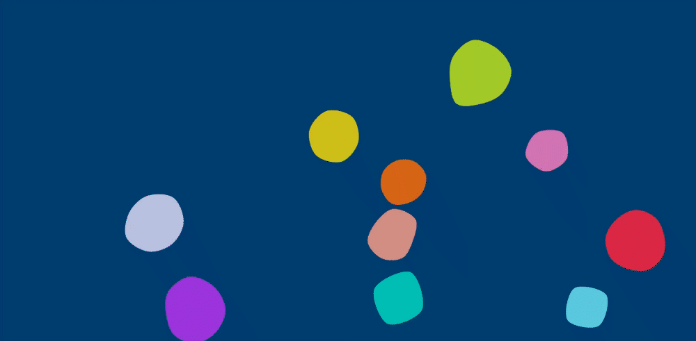

# Dynamic Layouts

Dynamic Layouts is a collection of visually appealing and customizable layouts built with React and TypeScript. These layouts are designed to be responsive, easy to integrate, and performance-optimized.

## Technical Details

- **Framework**: React with TypeScript
- **Build Tool**: Vite
- **Release Management**: Semantic Release

## Getting Started

To get started with Dynamic Layouts, you can install it via [NPM](https://www.npmjs.com/package/@sevastian-bahynskyi/dynamic-layouts)

```sh
npm i @sevastian-bahynskyi/dynamic-layouts
```

## Layouts

### Squared Layout

The Squared Layout is a grid-based layout where each square can be individually customized. It adapts seamlessly to different screen sizes and is highly flexible for various use cases.

- **Grid-Based**: Each square in the grid can be individually customized.
- **Responsive**: Adapts seamlessly to different screen sizes.
- **Flexible**: Can be used as a background or a standalone component.
- **Performance Optimized**: Efficient and fast loading times.

#### Result


### Blobs Layout

The Blobs Layout features animated, morphing blobs that move organically within a container. This layout is perfect for creating dynamic and engaging backgrounds.

- **Animated Blobs**: Features morphing blobs that move organically.
- **Dynamic Backgrounds**: Ideal for creating engaging and dynamic backgrounds.
- **Customizable**: Highly flexible and configurable to meet various needs.
- **SVG Based**: Utilizes SVG for smooth animations and scalability without loss of quality.

#### Result


